# Autobahn

```mermaid
sequenceDiagram
actor Alice
participant Autobahn as 🛣<br/><br/>Autobahn #32;
participant DynamoDB as 🥞<br/><br/>DynamoDB
participant S3 as 🪣 <br/><br/>dotstorage-prod-1

Alice -->> Autobahn: GET autobahn.dag.haus/ipfs/bafyROOT...
Autobahn -->> DynamoDB: bucket, key, offset, length for bafyROOT?
DynamoDB -->> Autobahn: In dotstorage-prod-1, x.car, 0, 100
Autobahn -->> S3: Read bafyROOT bytes
S3 -->> Autobahn: bafyROOT bytes
note over Autobahn:Decode root block<br/>no data, just links...

Autobahn -->> DynamoDB: bucket, key, offset, length for bafkBLOCK1?
DynamoDB -->> Autobahn: In dotstorage-prod-1, x.car, 100, 200
Autobahn -->> S3: Read bafkBLOCK1
S3 -->> Autobahn: bafkBLOCK1 bytes
Autobahn -->> Alice: UnixFS file bytes

Autobahn -->> DynamoDB: bucket, key, offset, length for bafkBLOCK2?
DynamoDB -->> Autobahn: In dotstorage-prod-1, x.car, 200, 300
Autobahn -->> S3: Read bafkBLOCK2
S3 -->> Autobahn: bafkBLOCK2 bytes
Autobahn -->> Alice: UnixFS file bytes

Autobahn -->> DynamoDB: bucket, key, offset, length for bafkBLOCK3?
DynamoDB -->> Autobahn: In dotstorage-prod-1, x.car, 300, 400
Autobahn -->> S3: Read bafkBLOCK3
S3 -->> Autobahn: bafkBLOCK3 bytes
Autobahn -->> Alice: UnixFS file bytes
```

Nuances:

* There is a DynamoDB request per block, but requests are sent in parallel (where possible).
* Block read batching also occurs as with Freeway.

Observations:

* Shorter TTFB than [Freeway](https://github.com/web3-storage/freeway) as less work to do up front.
* Slow per block RTT, as one database query per block.
* Less effective batching as offsets need to be fetched async per block.
